# Simple-Chat-Client-Server
 A simple single server chat client

## Usage
- Run the “Server” class.  
 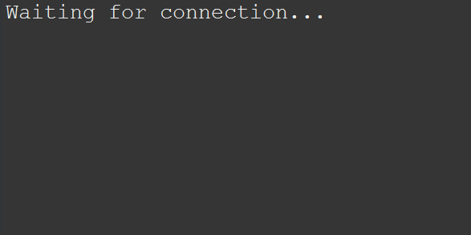
- Run the “Client” class.  
 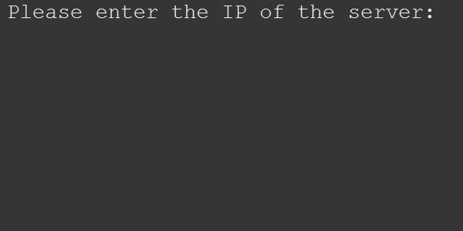
- Enter the IP address of the device running the server.(The client exits if it receives a wrong IP address).  
 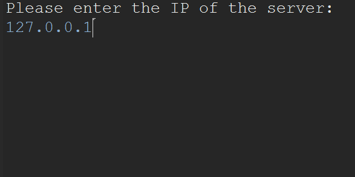
- You now have to enter a username. You can choose any username that you like as long it is not “REFRESH” or if it is already in use.  
 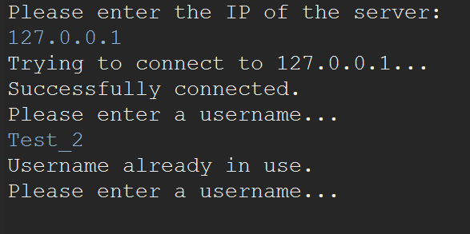
- The client will keep asking the user for a username until they enter a proper one. When they do, they will receive a message informing them that they have successfully connected to the server using the specified username.  
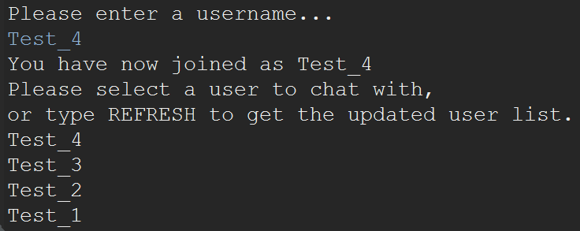
- In this state you are able to :
  - Receive messages from other users on the server.  
  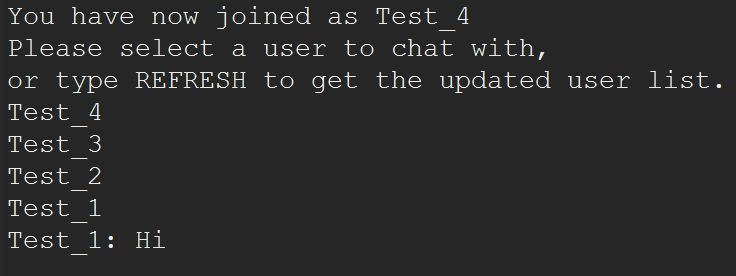
  - Type “REFRESH” (all uppercase) to get an updated userlist.  
  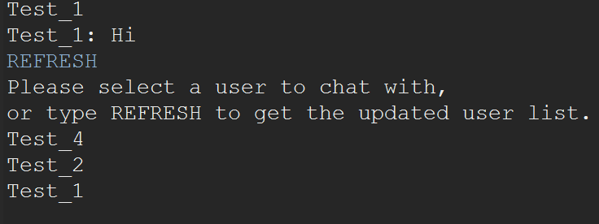
  - Choose a user to send messages to.  
  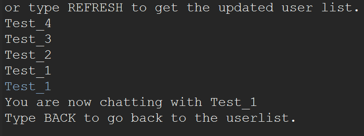
- After choosing a user to chat with you can:
  - Type “BACK” (all uppercase) to return to the userlist and choose a different user to chat with.  
  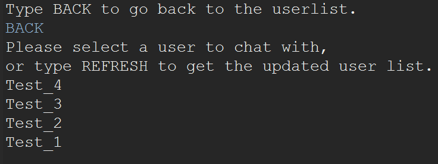
  - Receive messages from all users.  
  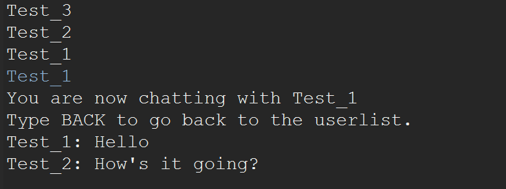
  - Type a message to the chosen user.  
  
  - If you have chosen a user that doesn’t exist, or the user left during the conversation, and you try to send a message, you receive a message from the server informing you that the user doesn’t exist, and that you should return back to the userlist.  
  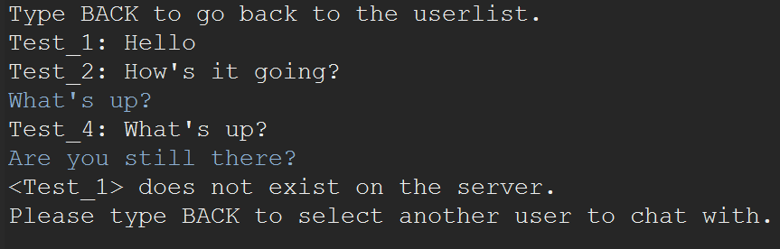
- You can type “BYE”/”QUIT” (all uppercase) to disconnect from the server and close the
client.
  - During joining.  
  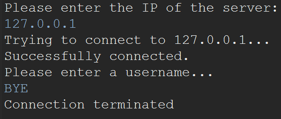
  - In the userlist.  
  
  - While chatting with a user.  
  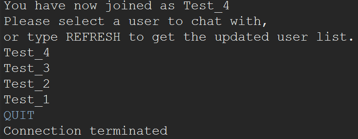
- Meanwhile, the server logs when
  - A user connects.
  - A user chooses a username.
  - A user disconnects.  
  
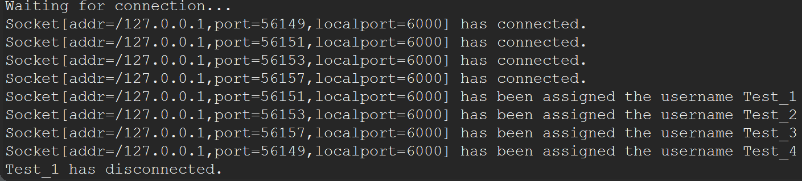
***
Done as a part of Introduction to Communication Networks course.
